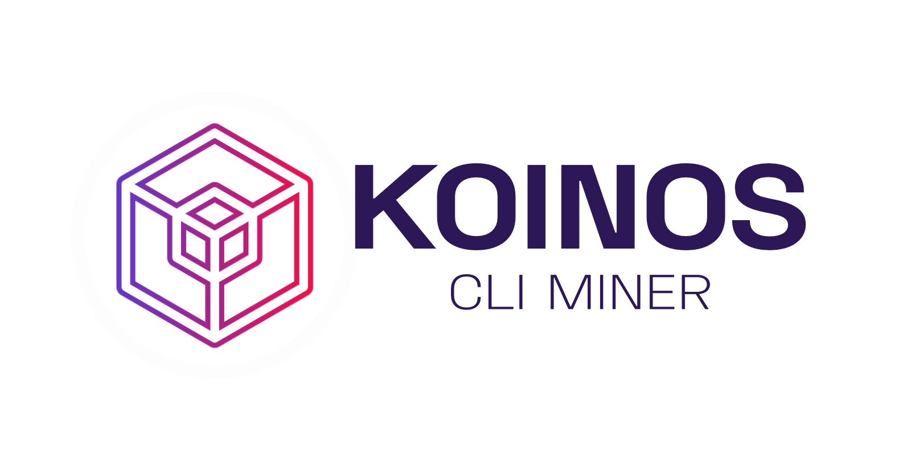

  

[](https://github.com/open-orchard/koinos-miner/issues)
[](https://github.com/open-orchard/koinos-miner/blob/master/LICENSE.md)

## Table of Contents
  - [Dependencies](#dependencies)
  - [Installation](#installation)
  - [Getting Started](#getting-started)
  - [Key Management](#key-management)

## Dependencies

Prior to installation, you'll need to install the necessary dependencies.

### Linux (Debian based)

```
sudo apt install openssl
```

### macOS

On macOS, installing `gcc` is required to support OpenMP parallelization. Using the `brew` package manager, install OpenSSL and gcc.
```
brew install openssl gcc
```

### Windows

On Windows, ensure that you are using the `MingW` compiler. Using the cholocately package manager, install OpenSSL.

```
choco install openssl
```

## Installation

For both Windows and Linux, you should be able to simply invoke the standard `npm` installer.

```
npm install
```

For macOS, you will need to specify the C compiler as `gcc`.

```
CC=gcc-10 npm install
```

## Getting started

You can view the CLI miner arguments by using `npm` like so:

```
npm start -- --help
```

And get the following output:

```
❯ npm start -- --help

> koinos-miner@1.0.0 start /Users/sgerbino/Projects/koinos-miner
> node app.js "--help"

Usage: app [OPTIONS]...

Options:
  -v, --version                      output the version number
  -a, --addr <addr>                  An ethereum address
  -e, --endpoint <endpoint>          An ethereum endpoint (default: "wss://ropsten-rpc.linkpool.io/ws")
  -t, --tip <percent>                The percentage of mined coins to tip the developers (default: "5")
  -p, --proof-period <seconds>       How often you want to submit a proof on average (default: "86400")
  -k, --key-file <file>              AES encrypted file containing private key
  -m, --gas-multiplier <multiplier>  The multiplier to apply to the recommended gas price (default: "1")
  -l, --gas-price-limit <limit>      The maximum amount of gas to be spent on a proof submission (default: "1000000000000")
  --import                           Import a private key
  --export                           Export a private key
  -h, --help                         display help for command
```

**Recipient Address**: The `--addr` argument specifies the recipient address, this is where KOIN will be rewarded.

**Ethereum Endpoint**: The `--endpoint` argument specifies the Ethereum node to be used when querying contract information and submitting proofs.

**Developer Tip**: The `--tip` argument specifies the percentage of rewarded KOIN to donate to the development team, thank you!

**Proof Period**: The `--proof-period` argument specifies the number of seconds on average the miner will attempt to mine and submit proofs.

**Gas Multiplier**: The `--gas-multiplier` argument specifies a multiplier to apply to the calculated gas price. This can be used to get your proofs submitted when the Ethereum network gas fees are spiking or are unpredictable.

**Gas Price Limit**: The `--gas-price-limit` argument specifies a cap in the acceptable gas price for a proof submission.

A more detailed explanation of the different miner configurations can be found in the [Koinos GUI Miner](https://github.com/open-orchard/koinos-gui-miner) `README.md`.

## Key Management

The CLI miner provides the arguments `--import`, `--export`, and `--key-file`. These are used in handling the private key of the funding address. The user may import a private key and optionally store it in a key file in which case exporting the key is now possible.

## License

Copyright 2020 Open Orchard, Inc.

Koinos Miner is free software: you can redistribute it and/or modify
it under the terms of the GNU General Public License as published by
the Free Software Foundation, either version 3 of the License, or
(at your option) any later version.

Koinos Miner is distributed in the hope that it will be useful,
but WITHOUT ANY WARRANTY; without even the implied warranty of
MERCHANTABILITY or FITNESS FOR A PARTICULAR PURPOSE.  See the
GNU General Public License for more details.

You should have received a copy of the GNU General Public License
along with Koinos Miner.  If not, see <https://www.gnu.org/licenses/>.
